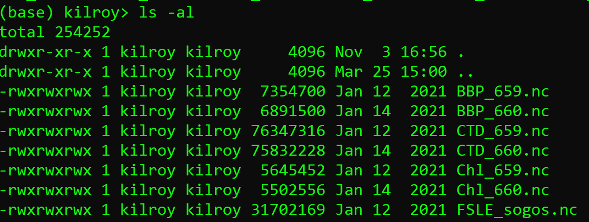

# greenandblack

Source file for this content is in the `gh-pages` branch, root folder, filename [`index.md`]([https://github.com/robfatland/greenandblack/edit/gh-pages/index.md](https://github.com/robfatland/greenandblack/blob/gh-pages/index.md)).

## Navigation links
- ...from the top, [nice format](https://robfatland.github.io/greenandblack), 
[github](https://github.com/robfatland/greenandblack/blob/gh-pages/index.md)
- ...the backing lexicon, [nice format](https://robfatland.github.io/greenandblack/lexicon), 
[github](https://github.com/robfatland/greenandblack/blob/gh-pages/lexicon.md)


## Contents

Green and black...

* [from the top](https://robfatland.github.io/greenandblack)
* [green and black](https://robfatland.github.io/greenandblack#just-make-it-green-and-black)
* [ssh tunnel](https://robfatland.github.io/greenandblack#ssh-tunnel)
* [bash](https://robfatland.github.io/greenandblack#bash)


## Nice format! What's your secret? 

This repo uses GitHub's **gh-pages** service: Built as a distinct `gh-pages` branch off the default **Main**.
**gh-pages** uses a jekyll template, whatever that is. There are, as a result, three places to be: 

- [The main branch of the github repo](https://github.com/robfatland/greenandblack/tree/main)
- [The gh-pages branch of the github repo](https://github.com/robfatland/greenandblack/tree/gh-pages)
- [The pretty documentation website](https://robfatland.github.io/greenandblack/)
    - [A sub-folder example](https://robfatland.github.io/greenandblack/vscode)


Here is how to get one of these https://**organization**.github.io/**repo** websites started:


- Create some repository on GitHub
- Menus: Github --> repo --> Settings --> **pages** tab on the left; choose a *theme*
- Switch to the `gh-pages` branch: From the `Main` branch, use the chooser
- At the documentation site it will be `index.md` that renders (not a README)
    - Edits can be a little slow to propagate; refresh!
- The root directory `index.md` renders as default content
    - Add other folders and markdown; but cross reference using documentation website URLs, not GitHub URLs
        - Example: **`https://organization.github.io/repo-name/subfolder`** renders the **`index.md`** therein


## motivating rant please?


I want to understand--say--my Linux bash installation on my Windows laptop... and I want simple
green text on a black background.  Not a lot of 'informative' colorized text. I did it once...
long ago... but there were
all these squonking little details. Every two years or so, give or take, I have to drag through
the same piddly little web searches and glaring my way through Stack Overflow answers...rrrrrr...
You know what this is? This is the curse of having a semi-IT
job while being a not-very-IT personality. So I put in some extra effort on these notes
and every couple years they will save me... hours? days? minutes? of teeth gnashing.


## Just make it green and black

### Intro

The scenario:


- I am working on a PC running some (say Windows Subsystem for Linux (WSL)) `bash` shell
- ...and I am peering into another machine, say a Virtual Machine...
- ...where unhappily it's nauseating colorized text...
- ...in both the **`bash`** shell and the **`vi`** editor...
- ...and it builds some byzantine prompt...
- ...but all I want is green on black with a simple prompt...


This bias was inspired by this guy Curtis, who is cool nevermind late to rehearsal.


### Everything I know about **`git`**

- `git pull` to get the latest; then `git add .` then `git commit -m 'ch ch ch changes'` then `git push`
- From `~` store creds using `git config --global credential.helper store`
- To abandon changes and back up: `git reset --hard HEAD` or if necessary `git reset --hard HEAD~1` etcetera
    - HEAD~n means n commits back

### **`bash`** fix 


Let's begin on the Ubuntu bash shell running on a Windows PC. This can be customized; 
independent of customizing a VM bash.


- Run the Ubuntu bash shell
- From the top window bar: Right click, select Properties, and set Color to green on black
- Increase font size, adjust whatever else you like
- Type `ls -al` to observe that *color support* is still enabled. Yeccch.
- Comment out these lines in `.bashrc`


```
# enable color support of ls and also add handy aliases
#if [ -x /usr/bin/dircolors ]; then
#    test -r ~/.dircolors && eval "$(dircolors -b ~/.dircolors)" || eval "$(dircolors -b)"
#    alias ls='ls --color=auto'
#    #alias dir='dir --color=auto'
#    #alias vdir='vdir --color=auto'
#
#    alias grep='grep --color=auto'
#    alias fgrep='fgrep --color=auto'
#    alias egrep='egrep --color=auto'
#fi
```

- Command line: `source ~/.bashrc`
- Check with `ls -al` again


### green text


For green text type this on the command line: `echo -e "Default \e[32mDefault"`


### prompt fix


The prompt's job is to tell me which computer I am entering commands on (and possibly whether
I am working inside a conda environment).


- Edit `~/.bashrc' in `vi`, scroll past the `$PS1` stuff
    - `$PS1` is a variable for the default bash prompt 
- Add this line:


```
PS1="my computer> "
```

- Command line: `source ~/.bashrc`

Now the prompt tells me when I am working on my local machine.
For VMs: Use simple but instructive prompts in like fashion. 

A conda environment name will be prepended to this bash prompt. By default this
prompt will be `(base) my computer> `. This is ok by me: When I switch
environments by means of `conda activate some-environment` the prompt will 
automatically change the prompt to `(some-environment) my computer>`. 


### ls fix

To change the colors of the text produced by `ls` check an online resource like [**this**](https://linuxhint.com/ls_colors_bash/).
The bare-bones to make directory names green is like so: 


- `dircolors -b >> .bashrc` appends the current **ls** color scheme to `.bashrc`
- edit `.bashrc` and go to the end of the file 
- Observe the dense text we just added:

```
LS_COLORS=`rs=0:di=01;34....etcetera etcetera etceters....;export LS_COLORS`
```

- These are key-value pairs. 
- The color green is '32' so find the entry for `di` (directory) and set it to `di=01;32`. 
- `source ~/.bashrc`
- `ls -al`


### **`vi`** fix

`vi` and `vim` are the same editor, specificially an ancient text editor 
with arcane syntax inherited from an even older editor called `ed`. `vim` 
is the modern version of `vi`. 


To disable a profusion of colorized text in `vi`: In escape mode type `:syntax off`. 


To disable a profusion of colorized text **permanently**:


```
vi ~/.vimrc

<escape>
G
o
syntax off
<escape>
:wq
```

- Re-run `vi` to verify this worked


### What is the point of conda environments? 


`conda create/activate` commands engage Python environments as customized versions of 
our base environment. 


- Needed: How does the current environment appear in the Jupyter notebook server interface? 


## ssh tunnel

### Outline


I want to run Jupyter on a secure VM inside the AWS cloud on a private subnet. Let's call this VM **`worker`**.
I have an intermediary bastion server called **`bastion`**. I'm going to connect from my local machine to
**bastion** to **worker** so that in my browser I see a Jupyter notebook server that is in fact running on **worker**. 
That means a two-hop ssh tunnel.


### Procedure


If **`bastion`** has a moving target public ip address: Assign it a fixed ip address. For example on AWS
this is called an *elastic ip*. Now that ip address can be baked into a connect alias.


- From **`local`** `bash`:

```
 $ ssh -i bastion.pem ubuntu@12.23.34.45
```

- Customize the environment... I hear green and black is nice
- From **`local`**: Move the `worker.pem` file to **`bastion`**
 
```
$ sftp -i bastion.pem ubuntu@12.23.34.45
sftp> put worker.pem
```

- **`ssh`** from **`local`** to **`bastion`** to **`worker`**
    - `ssh ubuntu@12.23.34.45 -i bastion.pem`
    - `ssh -i worker.pem ubuntu@10.0.1.234`
        - This uses the VPC private subnet ip address for **`worker`**


- On worker start a headless Jupyter notebook server
    - `(jupyter notebook --no-browser --port=8889) &`
        - The choice of port is fairly arbitrary; but we do not want it to collide with a port that is in use
        - This command produces a lot of output
        - Towards the end: copy the long token string
            - It looks like **`4109891ab3e0ec38c2aec9c427c8be11eda975ab2882a52a`**
    - `exit`
    - First time doing this: Log back in to **`worker`** and verify the server is still running 
        - `ps -ef | grep jupyter`
        - `exit`
    - On **`bastion`** create an ssh tunnel
        - `ssh -N -f -i worker.pem -L localhost:7005:localhost:8889 ubuntu@10.0.1.234`
            - Same as above remark: On port choice 7005
            - This command associates inbound **`bastion`** traffic on port 7005 to outbound > **`worker`** port 8889
        - `exit`
    - On **`local`** create the second part of the tunnel to **`bastion`**
        - `ssh -N -f -i bastion.pem -L localhost:7004:localhost:7005 ubuntu@12.23.34.45`
    - **`local`** browser address bar
        - `localhost:7004`
        - If promnpted: paste in token string copied above
  
  

## bash

### List volumes for only top-level directories

```
du -h -d1
```

### CPU monitoring (many-core machine)


Wes says: "Use **`top`** from the bash command line."


Wes says: "CloudWatch metrics (AWS EC2 console GUI) are delayed, updated once every 5 minutes.
A localized spike in CPU use will take some time to display in the console. It is possible 
to pay for a higher sampling rate in the console... but why?"


### Keep a VM patched

```
sudo apt-get update -y && sudo apt-get upgrade -y
```


